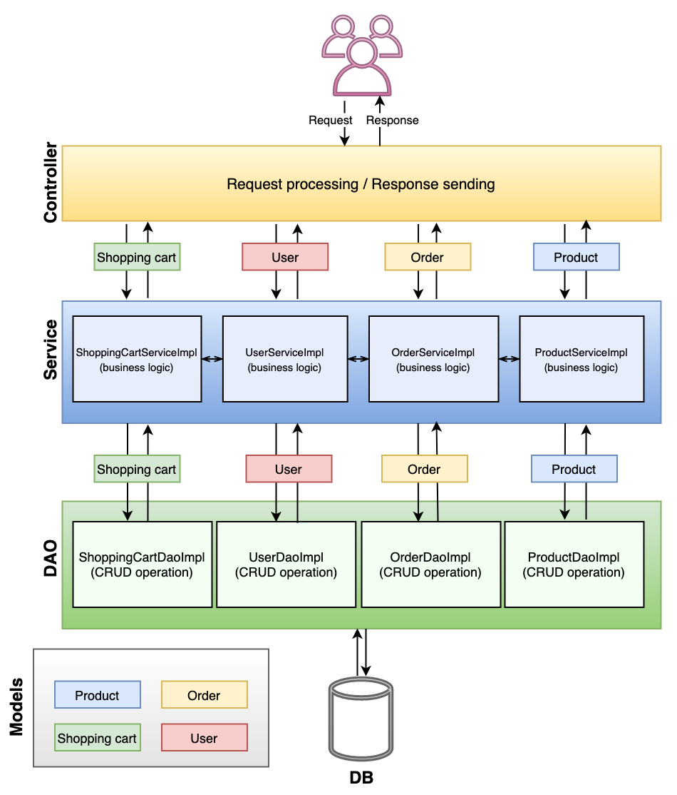
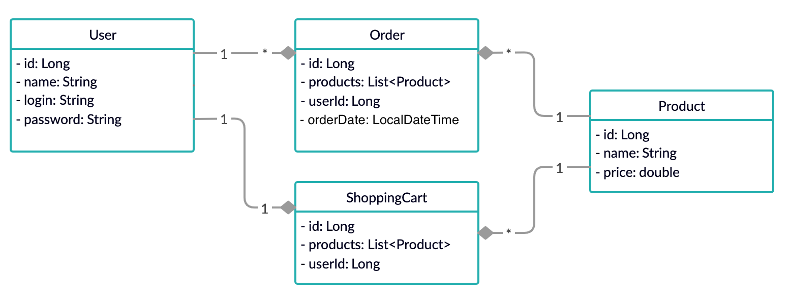

# Internet-Shop
A pet project shop with basic functionality for user, products and admin written in Java

## Project structure
The project builds on an N-tier architecture and consists of the controller level which handle requests, service layer with business logic, DAO layer for access to DB and DB itself.

Servlets run on Tomcat server to handle HTTP requests. The DAO layer includes implementation for the JDBC. 

**UML Model Diagram**

This project also includes custom-made annotations and an injector, which utilizes Reflection API. 

**Users can perform the following actions:**
 - registration;
 - log in and out;
 - access to full item's list;
 - add items to their cart;
 - delete items from the cart;
 - place orders. 
 
 **Admin can perform the following actions:** 
  - manage users list;
  - view all orders placed at the store; 
  - edit the store's item list.
  
## Technologies used:
 - Java 11
 - Maven 3.1.1
 - Javax Servlet API 3.1.0
 - JSTL 1.2
 - JSP
 - Apache Tomcat
 - MySQL RDBMS
 - Bootstrap 
## How to set up your internet-shop
1. Clone this repo to your IDE
2. Configure TomCat and MySQL on your local machine
3. Create a database with init_db.sql script (don't forget to configure ConnectionUtil)
4. To create admin user click "Inject Data" on index page when app is running